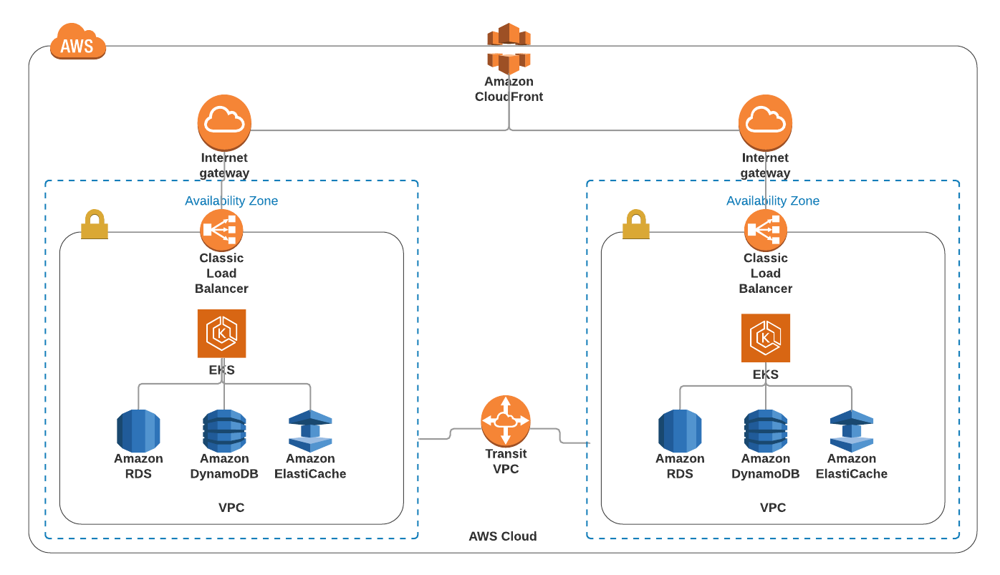

Este esquema de red tiene como mision representar la arquitectura solicitada en el test.

Como primer servicio nos encontramos con Cloudfront, la principal funcionalidad es servirnos de CDN para optimizar el tiempo de respuesta de nuestra infraestructura. Ademas de proveer una capa de seguridad para prevenir ataques DDoS y actuar de WAF entre otras caracteristicas.
El Internet Gateway nos permitira publicar nuestro servicio y tambièn consumir los microservicios externos.
El frontend se encontrará desplegado en EKS con su respectivo HPA para soportar las cargas variables tomando las metricas proveidas con CloudWatch; El consumo del frontend se realiza mediante un load balancer como puede ser traefik, nginx. Este esquema posee actualmente una replica por cada AZ, podrian escalarse los servicios y balancear mediante un ALB.
La arquitectura establecida cuenta con dos zonas de disponibilidad para asegurar la HA de los servicios; todos los servicios, tanto el frontend como las DBs están replicadas en ambas zonas. Esto es algo a poner en contexto ya que se deberia tener en cuenta la cantidad de datos que maneja la DB para ver la factibilidad de replicacion de las bases en tiempo real entre las zonas mediante transit VPC.
Se agrega además una caché para que las consultas realizadas a la DB se respondan con mayor velocidad, además de esto la cache nos permite alivianar los recursos de las DBs.

La arquitectura esta integramente realizada en AWS, en caso de contar con otro cloud provider o poseer con antelacion parte de esta infraestructura on premise se puede realizar la conexion mediante DirectConnect. 